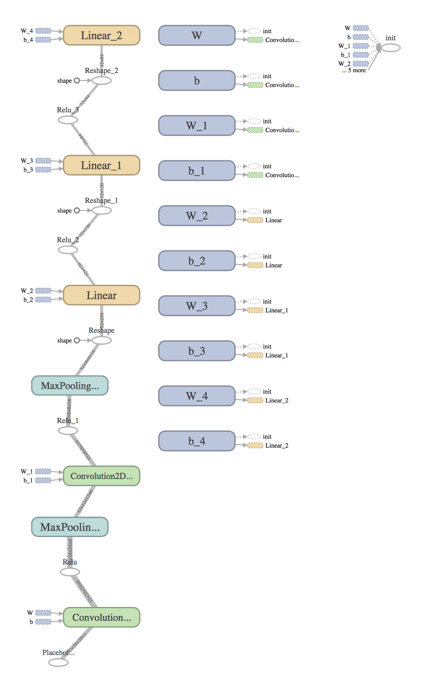
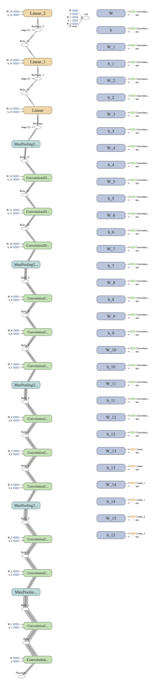

# tfchain

Alternative Chain implementation with TensorFlow backend

# Requirements

- CUDA 8.0
- cuDNN 5.1
- Chainer 1.17.0+
- TensorFlow 0.11.0rc2

## Environmental Setup

```
export TF_BINARY_URL=https://storage.googleapis.com/tensorflow/linux/gpu/tensorflow-0.11.0rc2-cp35-cp35m-linux_x86_64.whl
pip install --upgrade -I setuptools
pip install --upgrade $TF_BINARY_URL
```

# Run tests

```
nosetests -s tests
```

# Run a MNIST example

```
python examples/mnist.py
```

# Usage

Just give a decorator `@totf` to the member function `__call__` of your model class that inherits from `chainer.Chain`. The following example is from `examples/mnist.py`, and it shows how to use TensorFlow for all computations performed inside the `__call__` function:

```
class LeNet5(chainer.Chain):

    def __init__(self):
        super(LeNet5, self).__init__(
            conv1=L.Convolution2D(1, 6, 5),
            conv2=L.Convolution2D(6, 16, 5),
            fc3=L.Linear(None, 120),
            fc4=L.Linear(120, 84),
            fc5=L.Linear(84, 10)
        )
        self.train = True

    @totf
    def __call__(self, x):
        h = F.max_pooling_2d(F.relu(self.conv1(x)), 2, 2)
        h = F.max_pooling_2d(F.relu(self.conv2(h)), 2, 2)
        h = F.relu(self.fc3(h))
        h = F.relu(self.fc4(h))
        h = self.fc5(h)
        return h
```

Don't miss the `@totf` decorator right before the `__call__` method definition.

Then, just give a `chainer.Variable` to the model object as usual, it runs on TensorFlow.

```
x = ...  # Prepare the input variable as a numpy array
model = LeNet5()
x = chainer.Variable(x)
y = model(x)  # It's performed with TensorFlow!
```

The returned value `y` will be a numpy array.

## Visualization

To visualize your Chainer model using tensorboard, just adding the below line following the model forward calculation part:

```
tf.train.SummaryWriter('data', graph=model.session.graph)
```

It creates `data` dir, so at the place the dir created, just launch tensorboard:

```
$ tensorboard --logdir=$PWD
```

where the path `$PWD` should have `data` dir.

Then go to `GRAPHS` tag, and enjoy the visualized graph.

### Chainer model visualization examples

LeNet5               | VGG16
-------------------- | -------------------
 | 
